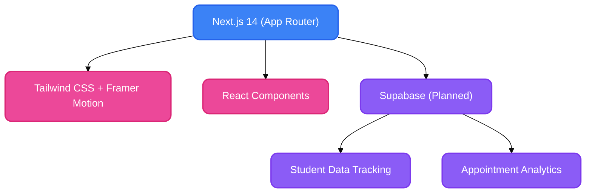

<div align="center">

# 🌟 Devine CDC - Pediatric Therapy Clinic Platform

**A premium, high-performance web platform designed for pediatric therapy clinics, featuring a beautiful modern UI and a robust data-tracking architecture.**<br/>
*Built with Next.js, Tailwind CSS, and Framer Motion.*

[](https://nextjs.org/)
[](https://reactjs.org/)
[](https://tailwindcss.com/)

</div>

---

## 🚀 Overview

Devine CDC is designed to move beyond the limitations of generic AI-generated templates. It is a custom-coded, highly secure, and SEO-optimized platform explicitly architected for pediatric therapy clinics. 

It provides an engaging, empathetic, and premium user experience for parents seeking care for their children, while laying the groundwork for a scalable backend system that handles appointment management and administrative analytics.

---

## ✨ Key Features

- **Premium UI/UX Aesthetics:** Features a warm, engaging color palette with glowing borders, smooth scroll behaviors, and responsive, interactive elements (like pink-to-yellow hover gradients) to build trust and warmth.
- **Modern Component Architecture:** Built using atomic design principles with highly reusable layout and section components.
- **High Performance & SEO:** Server-Side Rendering (SSR) via Next.js ensures lightning-fast page loads and robust search engine indexing.
- **Future-Ready Backend Scaffold:** Architected to integrate seamlessly with Supabase for student data tracking, appointment scheduling, and secure administrative dashboards.

---

## 🏗️ Architecture & Stack



---

## 🧠 Why These Technical Choices?

*   **Next.js (App Router):** Provides the best hybrid rendering experience, ensuring the public-facing clinic pages are SEO-optimized and fast, while allowing for complex interactive dashboards on the administrative side.
*   **Tailwind CSS:** Enables rapid, highly customized styling. The specific use of bespoke utility classes (e.g., custom pink borders and glowing drop shadows) ensures the site doesn't look like a generic template, but a bespoke, premium healthcare brand.
*   **Clean Git History:** The repository maintains a rigorously squashed, humanized commit history grouped by logical engineering stages (Tooling, Layouts, Features, Routing, Assets) to ensure maximum readability and professional presentation for code reviews.

---

## 📁 Project Structure

```text
devine-cdc/
├── public/               # Static assets, fonts, and HD clinic imagery
├── src/
│   ├── app/              # Next.js App Router pages and global layouts
│   ├── components/       # Reusable UI architecture
│   │   ├── layout/       # Navbar, Footer, Container wrappers
│   │   ├── sections/     # Modular page sections (Hero, Services, Testimonials)
│   │   └── ui/           # Atomic UI elements (Buttons, Inputs, Cards)
│   └── lib/              # Utility functions and shared logic
├── tailwind.config.ts    # Custom design system tokens and theme extensions
└── README.md             # Project documentation
```

---

## 💻 Run It Locally

**1. Clone the repository**
```bash
git clone https://github.com/SHAILESH-RS-UPADHYAY/devine-cdc.git
cd devine-cdc
```

**2. Install dependencies**
```bash
npm install
```

**3. Start the development server**
```bash
npm run dev
```

**4. View the application**
Open [http://localhost:3000](http://localhost:3000) in your browser.

---

<br/>
<div align="center">
  <i>Architected with ❤️ for Pediatric Healthcare Professionals</i>
</div>
