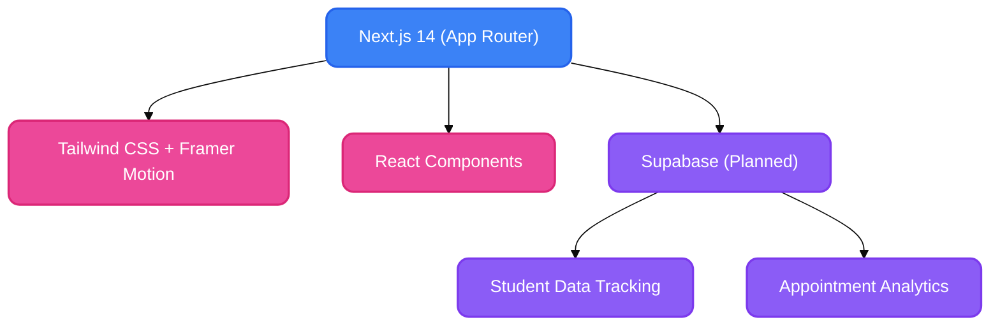

<div align="center">

# 🌟 Devine CDC - Pediatric Therapy Clinic Platform

**A premium, high-performance web platform designed for pediatric therapy clinics, featuring a beautiful modern UI and a robust data-tracking architecture.**<br/>
*Built with Next.js, Tailwind CSS, and Framer Motion.*

[](https://nextjs.org/)
[](https://reactjs.org/)
[](https://tailwindcss.com/)
[](https://www.typescriptlang.org/)

</div>

---

## 🚀 Overview

Devine CDC is designed to move beyond the limitations of generic CMS templates. It is a custom-coded, highly secure, and SEO-optimized platform explicitly architected for pediatric therapy clinics. 

It provides an engaging, empathetic, and premium user experience for parents seeking care for their children, while laying the groundwork for a scalable backend system that handles appointment management and administrative analytics.

---

## 🏗️ Architecture & Stack



### 🧠 Technical Design Decisions

*   **Next.js (App Router):** Selected for hybrid rendering (SSR/SSG), ensuring public-facing clinic pages are SEO-optimized with sub-second TTI, while supporting interactive client-side dashboards.
*   **Modular Component Architecture:** Enforces strict separation of concerns. UI atoms, layout wrappers, and business-logic sections are isolated.
*   **Production-Grade Configs:** Strict TypeScript configurations, enforced HTTP security headers, and automated static generation rules in `next.config.ts`.
*   **SEO & Accessibility:** Dynamic `sitemap.xml`, `robots.txt`, and metadata generation. Semantic HTML and accessible color contrast ratios ensure WCAG compliance.
*   **Error Boundaries:** Global custom `error.tsx` and `not-found.tsx` ensure application resilience and graceful failure degradation.

---

## 📁 Project Structure

```text
devine-cdc/
├── public/               # Static assets, fonts, and HD clinic imagery
├── src/
│   ├── app/              # Next.js App Router (Pages, Layouts, Error Boundaries, SEO)
│   ├── components/       # Reusable UI architecture
│   │   ├── layout/       # Global wrappers (Navbar, Footer, Container)
│   │   ├── sections/     # Modular business-logic sections
│   │   └── ui/           # Atomic UI elements
│   └── lib/              # Shared utilities, constants, and content models
├── next.config.ts        # Next.js configuration and security headers
├── tailwind.config.ts    # Custom design system tokens
└── README.md             # Project documentation
```

---

## 💻 Local Development

**1. Clone the repository**
```bash
git clone https://github.com/SHAILESH-RS-UPADHYAY/devine-cdc.git
cd devine-cdc
```

**2. Install dependencies**
```bash
npm install
```

**3. Environment Variables**
Copy the `.env.example` to `.env.local` (if applicable) and populate required keys.

**4. Start the development server**
```bash
npm run dev
```

**5. Production Build Testing**
```bash
npm run build && npm start
```

---

<br/>
<div align="center">
  <i>Architected with ❤️ for Pediatric Healthcare Professionals</i>
</div>
